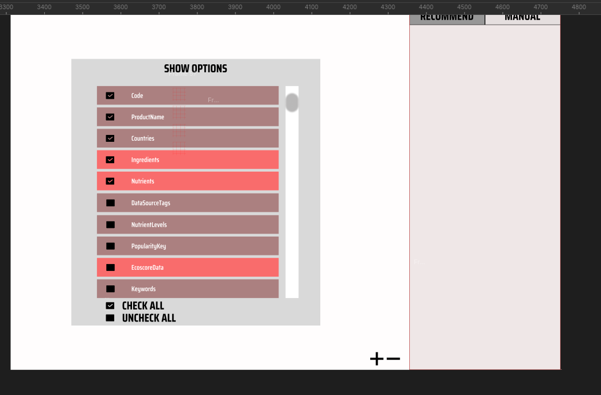

# Food Data Use Case
In this use case, a user wants to convert their food data from Open Food Facts to rdf with existing vocabularies if any are suitable. The use case shows how the process could go if our tool was used instead of looking for vocabularies and transforming data manually. The use case serves for introducing features that could be usable for the tool. The use cases should be a motivation for creation of the tool and a preview of the main functional requirements. 

The data for each product are around 1000 lines long json with a lot of information that provide little meaning to a non-author person. Look in `food.json` for an example. An example of the data for noodles and its most important fields are shown below. The user wants to convert these to rdf and ignore the rest.

```json
{
    "product": {
        "_id": "0737628064502",
        "product_name": "Thai peanut noodle kit includes stir-fry rice noodles & thai peanut seasoning",
        "countries": "United States",
        "ingredients": [{
            "has_sub_ingredients": "yes",
            "id": "en:noodle",
            "percent_estimate": 53.8461538461538,
            "percent_max": 100,
            "percent_min": 7.69230769230769,
            "rank": 1,
            "text": "Noodle"
        }],
        "nutriments": {
            "calcium": 0.038,
            "calcium_100g": 0.038,
            "calcium_serving": 0.0198,
            "calcium_unit": "mg",
            "calcium_value": 38
        },
        "...": "..."
    }
}
```

The use case uses food product data for which there are a few vocabularies capable of representing a food product even sometimes along with nutrition information and ingredients - [FoodOn](https://foodon.org/), [The FoodOntology](http://akswnc7.informatik.uni-leipzig.de/dstreitmatter/archivo/purl.org/foodontology/2020.06.10-203447/foodontology_type=generatedDocu.html#introduction) and some ontologies for categorizing food products (but mostly wihout properties, just thesaurus) - [AGROVOC](https://agrovoc.fao.org/browse/agrovoc/en/page/c_5274).

The use case has two sub use cases which share the input data but differ in output data. In the former one, the user uses any vocabulary terms that the tool can find to represent various entities and properties. In the latter, the user decides to not reuse vocabularies much and insteads wants to generated new vocabulary terms based on the data (create a new vocabulary (vocabularies) and represent part of the data using them). The reason might be that the aforementioned vocabularies have little properties, have different focus - e.g. agricultural or are too complex to understand.

## Common Part 

### Loading Data
The user loads a json with product data into the tool. Since there may be a lot of entities which are not important and do not need to be shown initially so that the data view is not cluttered, the users selects what is shown. The user also selects which parts of data are not to be converted to rdf. A visualization is shown of the picture below where the user picks what to load from the loaded data. 


### Mapping Countries Property

When the data is loaded, the user wants to see what is loaded graphically. This is shown in the next picture where the loaded data are converted to schema representing the data schema.


There is a graphical representation of entities (light red rectangles) with their literal properties (dark red rectangles) and properties to other entities (arrows). The user should be able to browse the data behind the schema which is visually represented with the eye buttons.

The user wants to start representing the data with known vocabularies - either through tool recommendations how the data can be matched to vocabulary terms or themself manually.

In the picture, there is only one recommendation called "Countries". The user selects it. For any recommendation the user typically wants to know what is the recommendation about (which property, entity) and what vocabulary and its terms were found matching the data. It would also be ideal if the user can browse the vocabulary and the terms in the app if URIs are not dereferencable or for convenience because they must decide whether the vocabulary and specifically the term fits the data. This is represented by the popup windows in the picture below. The window also contains information what method the recommendation was created from. The option of browsing experience is indicated by the eye buttons and the box with rdf tutrle showcasing an example of the vocabulary or term properties which corresponds to one such eye button being clicked by the user (highlighted by green color).


The user likes the recommendation based on the introductory information and gets more details about what from vocabulary matches with the data. This is shown in the picture below.


Lastly, the user wants to see the change of the schema if they go through the recommendation. This is shown in the picture below where new things added to the schema have pink/purple color.


Updated schema can be seen on the picture below. Any change from the input data (e.g. changed properties, added entities) are shown in pink/purple color. This is where the two sub use cases split.


## Sub Use Case With Vocabularies

## Sub Use Case With Generated Vocabulary

## [Figma Use Case](https://www.figma.com/file/Llz9ODDgnr5dFHuXqtnddn/Mapovac?type=design&node-id=0-1&mode=design&t=XvDpDoj2Bbh26wVq-0)
The starting point of this use case is the middle results of use case 2. The uses matched property values of property "countries" to [countries scheme](http://publications.europa.eu/resource/authority/country) general purpose matching methods. 



The user selects `Nutriments` recommendation which found matching "[nutrients](http://aims.fao.org/aos/agrovoc/c_5274)" term in AGROVOC thesaurus. The user can also preview what properties it has. The user inspects it but based on the definition does not found the terms matching. However, rather than "nutrients" he founds a related term while browsing the data which fits the match - "[food composition](http://aims.fao.org/aos/agrovoc/c_10961)" and manually adds the entity to this class (next frame).

The "nutriments" entity then contains a lot of properties such as calcium or energy values for given product. The calcium composition has at least three properties so it is further refactored manually to new entity representing calcium component in the food composition. The same thing is done for all such component properties such as energy, carbohydrates, etc. 

On the next frame, the tool detected a recommendation to convert a unit for food composition values from literal to URI in library. Specifically, "g" literal to [gram entity](http://qudt.org/vocab/unit/GM). Part of the recommendation is the link to the vocabulary of the found matching entity which can be previewed as well as the entity itself. The user has a chance to inspect what the found term means and whether to use it or something else from the library.

If user proceeds with the recommendation, the is a detail view showing how the match was found (method) and values that were matched. This is very simple in this case, since the literals matched by string comparison on literals.

Proceeding with the recommendation shows the recommended change in the graphical model.

The following two frames then show the performed recommendation for "calciumUnit" and "energyUnit" where the process is the same but for "kcal".

Now the user is satisfied with the model and wants to get the output rdf where the unmapped values should be part of new generated vocabularies. The tool detects all unmapped properties and provides a way to create new vocabularies and map them remaining unmapped properties to them. The first frame shows the unmapped properties in red.

The user adds 


