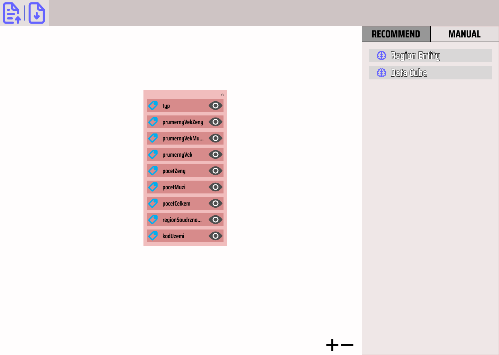
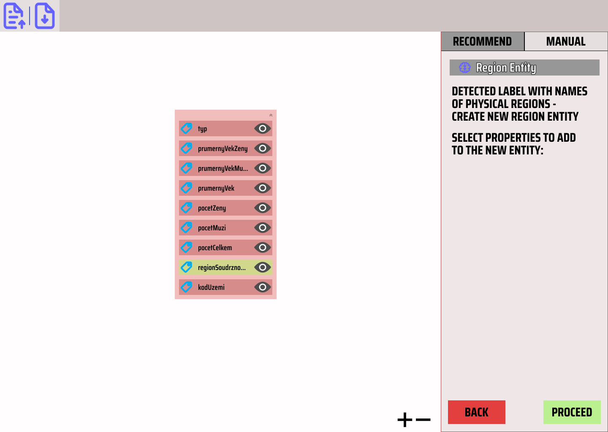
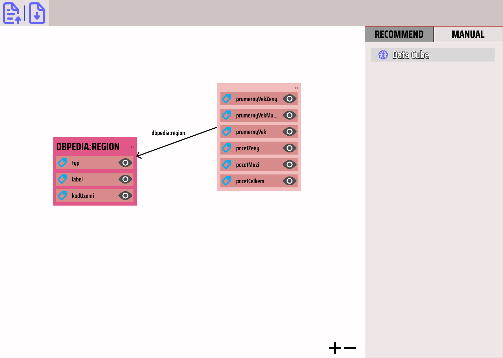
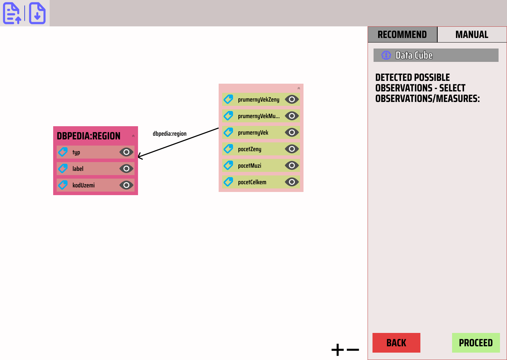
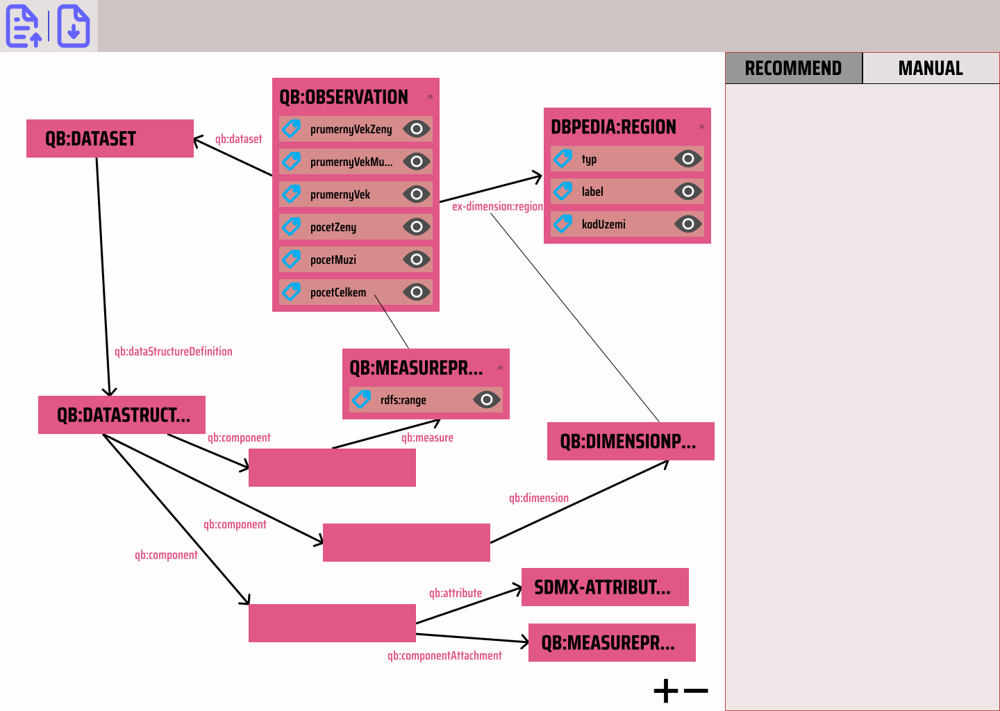

# Statistical Data Use Case

In this use case, a user wants to convert their statistical csv data about czech regions to rdf so that entities and properties are represented correctly using known vocabularies.

This is a follow up to the food use case so there will be a lot of steps skipped and the focus will be on a vocabulary specific recommendation rather than on general purpose recommendation which was showcased in the food use case.

Vocabulary specific recommendation means that it recommends to change the schema and represent part of the schema using specific vocabulary certain way that would not be possible with using any general purpose matching method (e.g. comparing by string).

The look the following way:

```csv
Kód území,Region soudržnosti,Pocet celkem,Pocet muži,Pocet ženy,Prumerny vek celkem,Prumerny vek muži,Prumerny vek ženy,typ
CZ0,Česko,10494836,5170902,5323934,42.7,41.3,44.2,zeme
CZ010,Hlavní město Praha,1259413,613316,646097,42.4,40.8,43.8,kraj
CZ020,Středočeský kraj,1372588,678250,694338,41.5,40.2,42.7,kraj
CZ031,Jihočeský kraj,636422,314988,321434,43.1,41.8,44.3,kraj
CZ032,Plzeňský kraj,576358,285530,290828,43.1,41.8,44.3,kraj
```

## Use Case

The initial schema of the data is shown in the picture below. It is just one entity representing a csv row with columns as properties. The tool provides two recommendations: `Region Entity`, `Data Cube`.



The user knows that the data contains regions; therefore, selects `Region Entity` recommendation which detected that property "regionSoudrznosti" points to literals with names of physical regions. This is just a general purpose recommendation described in the food use case so it will be skipped here and only result shown.



The result of applying the recommendation is shown below where a new entity matching representing a physical region was created and given some properties originally attached to the row entity.



The user selects `Data Cube` recommendation. This recommendation detected several possible literals (green highlight) which could serve as observations in a data cube in Data Cube vocabulary.



The user does not know the vocabulary so it is up to the recommendation to represent the data correctly in the vocabulary. To correctly represent a statistical cube, at least dimensions must be identified. It would be also nice if measures and some attributes could be inferred. If they are not inferred or are inferred incorrectly, the user wants to be able correct it and select the dimensions themself even if they are not an expert on the vocabulary (e.g. the recommendation provides a help text to help do it correctly). This is shown in the picture below.


Since the recommendation is ultimately tied to Data Cube vocabulary, it can include constraints of what must be in the data to use the recommendation or what would be good if the data had for good Data Cube representation. The recommendation could then nudge the user to select the correct unit attributes, measures, etc...

Below are the data represented in Data Cube. Note that since the recommendation is tried to the vocabulary, it can make vast schema changes such as adding a lot of new entities, blank nodes etc.. which would not be feasible in case of general purpose recommendation.


